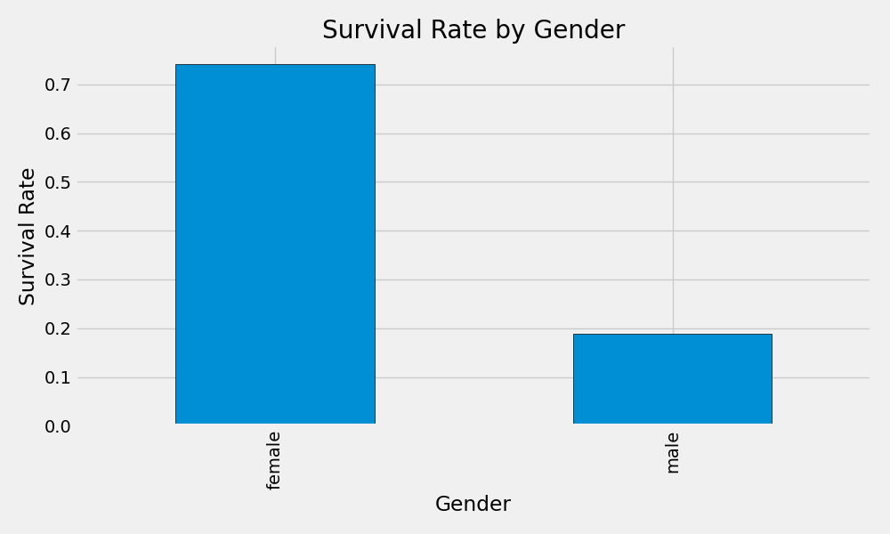
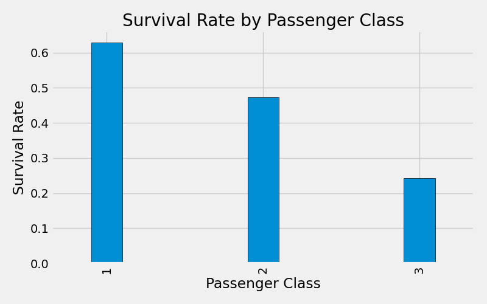
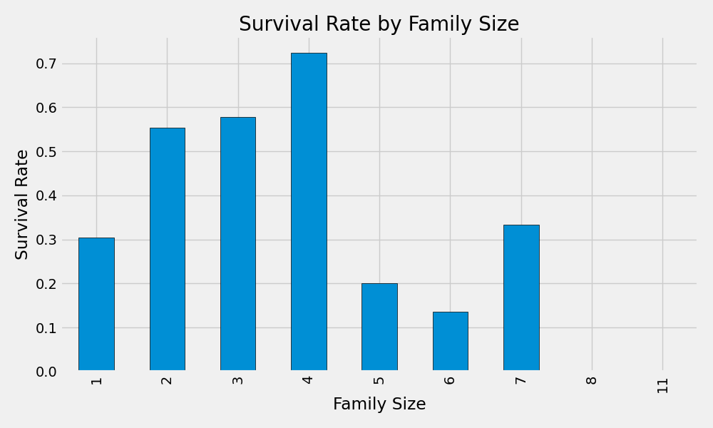
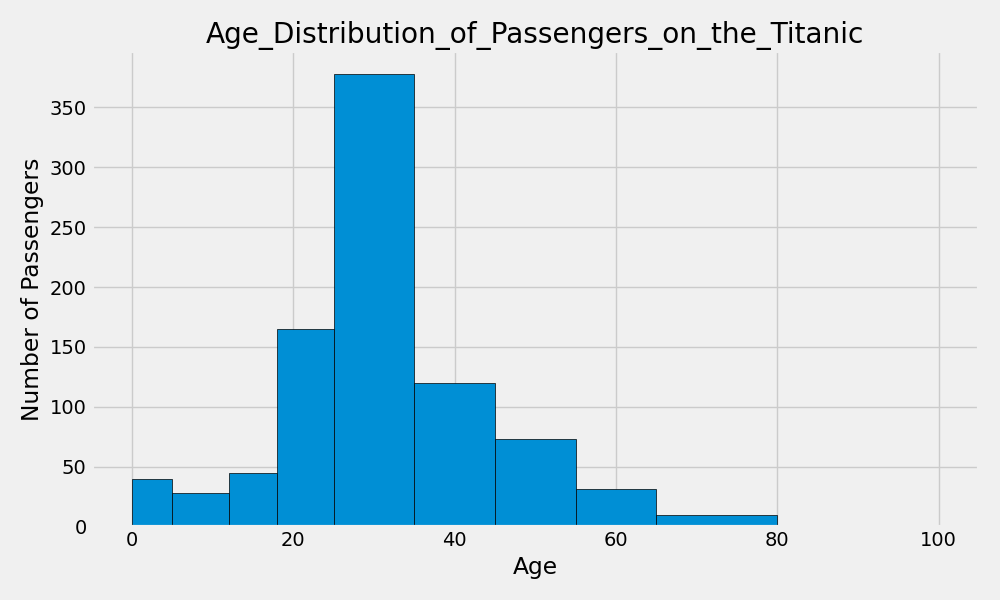
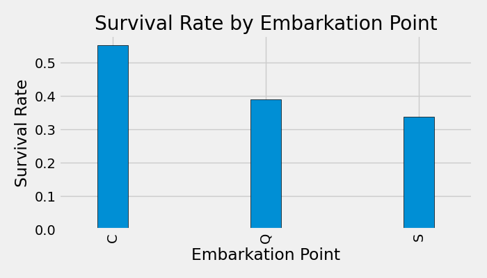

# Titanic Data Visualization & Insight Report

Visual analysis of the Titanic dataset using Matplotlib. Five charts exploring survival patterns across gender, passenger class, family size, age, and embarkation point.

---

## Problem

Raw survival numbers tell you little. This project turns cleaned Titanic data into visual stories — making patterns immediately obvious that groupby tables alone cannot communicate.

---

## Project Structure

```
DATA_VISUAL_INSIGHTS/
├── data/
│   └── titanic.csv              # Source dataset
├── plots/
│   ├── Survival_Rate_by_Gender.png
│   ├── Survival_Rate_by_Passenger_class.png
│   ├── Survival_Rate_by_family_size.png
│   ├── Age_Distribution_of_Passengers.png
│   └── Survival_Rate_by_Embarkation_Point.png
├── analysis.ipynb               # Full notebook with code + commentary
├── report.md                    # Written insight report
├── requirements.txt
└── README.md
```

---

## Approach

### 1. Data Cleaning
- Dropped `Cabin` (687/891 missing — unrecoverable)
- Filled `Age` nulls with **median**
- Filled `Embarked` nulls with **mode**

### 2. Feature Engineering
- `FamilySize = SibSp + Parch + 1`

### 3. Visualisation
- 5 charts saved as PNG to `/plots`
- Consistent `fivethirtyeight` style across all plots
- Age binned into meaningful groups: 0–5, 6–12, 13–18, 19–25, 26–35, 36–45, 46–55, 56–65, 66–80

---

## Charts & Key Insights

### 1. Survival Rate by Gender

- Women survived at **74%** vs men at **19%**
- Strongest single predictor of survival in the dataset

### 2. Survival Rate by Passenger Class

- 1st class: **63%** · 2nd class: **47%** · 3rd class: **24%**
- Clear wealth gradient — access to lifeboats was not equal

### 3. Survival Rate by Family Size

- Solo travelers: **30%** survival
- Small families (2–4): **55–72%** survival
- Large families (5+): dropped to near **0%**
- Sweet spot = travelling with 1–3 others

### 4. Age Distribution of Passengers

- Most passengers were aged **18–35**
- Children under 12 were a small group but survived at higher rates
- Very few passengers over 65

### 5. Survival Rate by Embarkation Point

- Cherbourg (C): **55%** · Queenstown (Q): **39%** · Southampton (S): **34%**
- Cherbourg advantage likely reflects higher proportion of 1st class passengers boarding there

---

## Error Analysis

**Where the visualisations have limits:**

- Age bins are unequal width — visual comparison between bins is slightly misleading
- Family size groups above 5 have very small sample sizes — bars look meaningful but are not statistically reliable
- Embarkation point correlation with survival is confounded by class — it is not the port itself that matters
- Median fill for 177 missing Age values slightly distorts the age distribution chart — the 25–35 bin appears artificially inflated

---

## How to Run

```bash
# Clone the repo
git clone https://github.com/yourusername/DATA_VISUAL_INSIGHTS.git
cd DATA_VISUAL_INSIGHTS

# Create virtual environment
python -m venv .visvenv
.visvenv\Scripts\activate  # Windows

# Install dependencies
pip install -r requirements.txt

# Open notebook
jupyter notebook analysis.ipynb
```

---

## Tech Stack

- Python 3.12
- pandas
- Matplotlib (`fivethirtyeight` style)
- Jupyter Notebook

---

## Key Learnings

- `plt.tight_layout()` must come **before** `fig.savefig()` — saving first captures unformatted output
- Binning continuous variables like Age makes group comparisons meaningful
- Visual patterns in survival data tell a clearer story than printed groupby tables
- Cleaning order matters — drop and fill nulls before any analysis or plotting